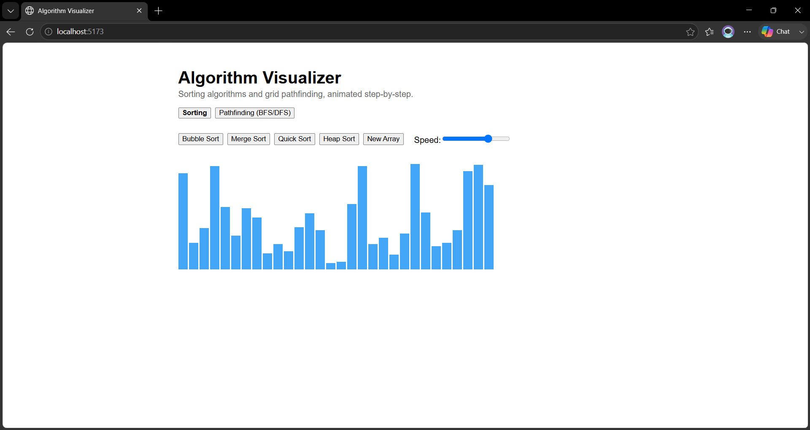

# Algorithm Visualizer

Sorting algorithms and grid pathfinding, animated step-by-step. Built to make abstract algorithm logic (comparisons, swaps, visited nodes) visible frame-by-frame instead of traced through pseudocode.

## Features

- **Sorting Visualizer** — Bubble Sort, Merge Sort, Quick Sort, Heap Sort with animated bars showing live comparisons and swaps
- **Pathfinding Visualizer** — BFS and DFS traversal on a draggable-wall grid, with color-coded visited nodes and final path
- Adjustable animation speed
- Randomized array/grid generation ("New Array" button)

## Tech Stack

- **React** (function components + hooks)
- **Vite** — dev server and build tool
- **Plain CSS** — no UI framework
- **Generator functions** (`function*` / `yield`) — decouple algorithm logic from animation timing; the algorithm code has no awareness of `setTimeout` or animation speed at all

## Getting Started

\`\`\`bash
git clone https://github.com/sarang3301/algorithm-visualizer.git
cd algorithm-visualizer/algo-visualizer
npm install
npm run dev
\`\`\`

Open `http://localhost:5173` in your browser.

## Project Structure

\`\`\`
algo-visualizer/
├── src/
│   ├── algorithms/
│   │   ├── sortingAlgorithms.js       # generator functions for each sort
│   │   └── pathfindingAlgorithms.js   # generator functions for BFS/DFS
│   ├── components/
│   │   ├── SortingVisualizer.jsx
│   │   ├── PathfindingVisualizer.jsx
│   │   └── useSortAnimation.js        # animation loop, consumes generator steps
│   ├── App.jsx
│   └── main.jsx
├── DESIGN_NOTES.md                    # trade-off writeup (Quick vs Merge, BFS vs DFS)
└── screenshots/
\`\`\`

## Design Notes

See [`DESIGN_NOTES.md`](./DESIGN_NOTES.md) for a breakdown of algorithmic trade-offs demonstrated in this project (e.g. Quick Sort's worst-case behavior on sorted input, BFS vs DFS guarantees).

## Deployment

Static site, no backend — deployable to Vercel, Netlify, or GitHub Pages with zero config.